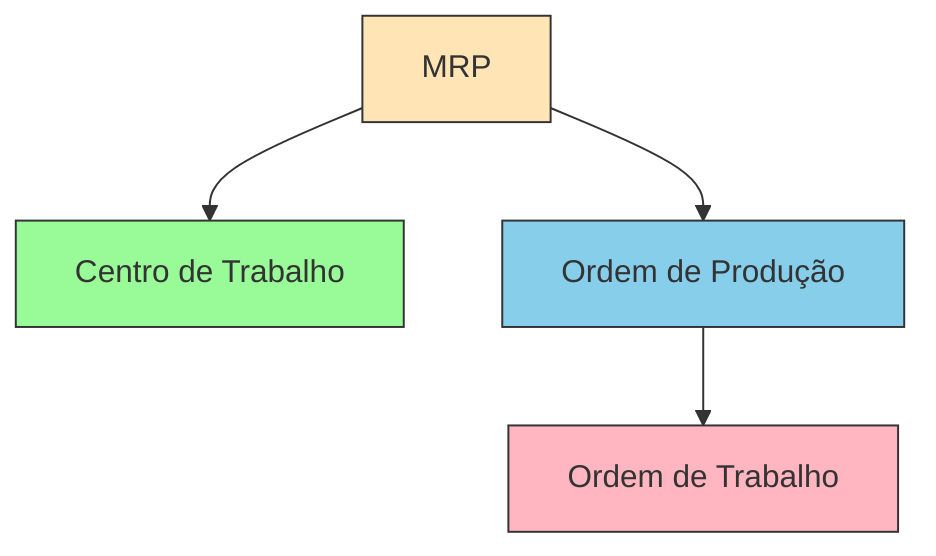

# streamlit1

```mermaid
graph TD
    MRP --> CentroDeTrabalho
    MRP --> OrdemDeProducao
    OrdemDeProducao --> OrdemDeTrabalho

    %% Node Labels
    CentroDeTrabalho[Centro de Trabalho]
    OrdemDeProducao[Ordem de Produção]
    OrdemDeTrabalho[Ordem de Trabalho]

    style MRP fill:#FFE4B5,stroke:#333
    style CentroDeTrabalho fill:#98FB98,stroke:#333
    style OrdemDeProducao fill:#87CEEB,stroke:#333
    style OrdemDeTrabalho fill:#FFB6C1,stroke:#333

```
